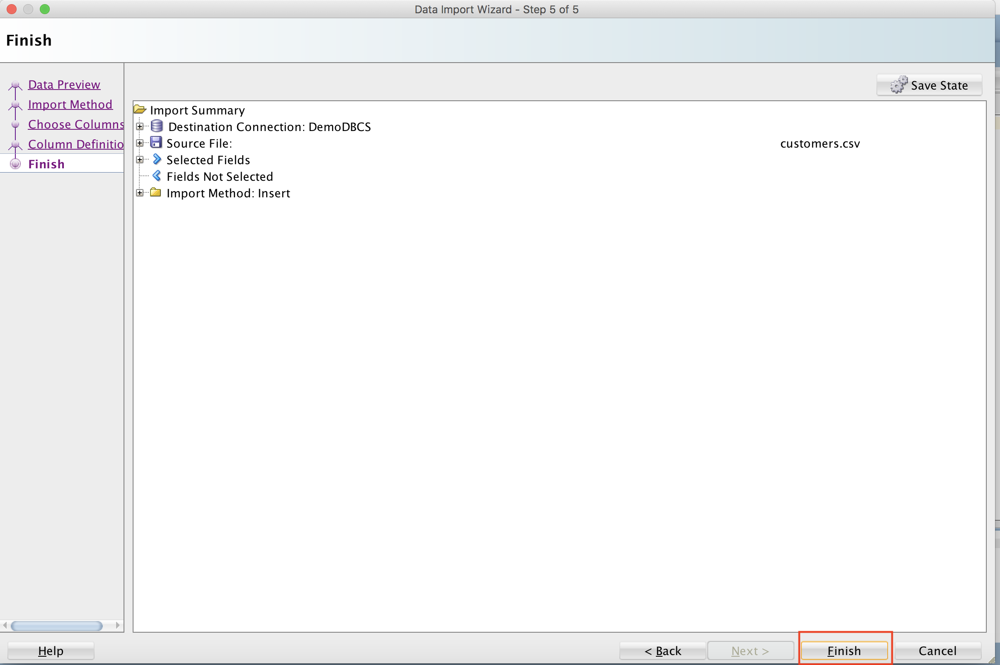
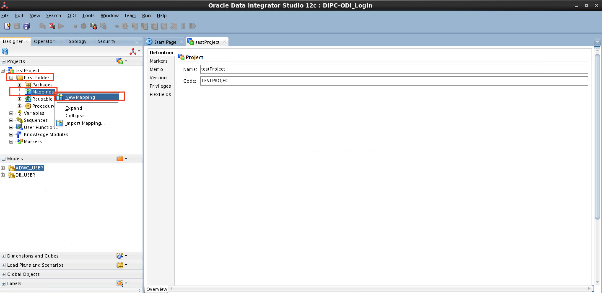
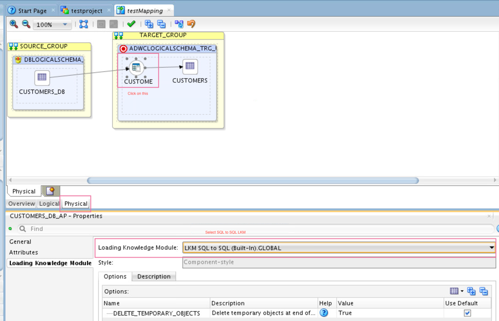

# **Lab 100 - Integrate relational data into ADWC**

In this very first lab of the workshop, we are going to load relational data from an Oracle Database Cloud Service (DBCS) instance into Oracle Autonomous Data Warehouse Cloud (ADWC) instance using Oracle Data Integration Platform Cloud (DIPC) (as shown in the below figure).


The source table is _CUSTOMERS_DB_ in the DBCS and the target table is _CUSTOMERS_ in ADWC. We use Oracle Data Integrator (ODI) that comes out-of-the-box with Oracle DIPC to perform the data loading.

## Objectives
The objectives of this lab are:
* Provision an Oracle Database Cloud Service (DBCS) instance
* Connect to the DBCS instance using SQL Developer and import relational data as a table
* Create empty table in ADWC with same structure as that in DBCS
* Provision an Oracle Data Integration Platform Cloud (DIPC) instance
* Configure DIPC to support ADWC as the target and the DBCS as the source
* Use Oracle Data Integrator Studio (ODI Studio) which is part of DIPC to load data from DBCS to ADWC
* Verify if the data is loaded in ADWC


## Prerequisites
* Please ensure you are connected to your cloud account and have provisioned an ADWC instance. Refer to [Introduction-Start-Here.md](Introduction-Start-Here.md) on how to provision an ADWC.


## A little about the services

### Oracle Database Cloud Service (DBCS)
* Enterprise-proven database cloud service that supports any size workload from dev/test to large scale production deployment.
* Multi-layered, in depth security with encryption by default. A highly available and scalable service delivering speed, simplicity and flexibility for faster time to value and savings.
* **Fast**: Oracle Database in highly available and scalable configurations rapidly provisioned and ready for use in minutes.
* **Elastic**: Add capacity on-demand and scale OLTP and Data Warehouse workloads as your business grows from startup to the largest enterprise.
* **Secure**: Security on Oracle Cloud protects the entire lifecycle of data both in transit and at rest. Database access is monitored and recorded for audit and control at all times.
* **Simple**: Oracle Database with administration fully managed by Oracle or under your control with one-click built in automation. Supports modern agile development with RESTful APIs for quick, automated and repeatable use.
* **Choice**: Shared, dedicated, virtualized, bare metal and engineered deployment targets to optimize cost in a pay per need model.

### Oracle Data Integration Platform Cloud (DIPC)
* Oracle Data Integration Platform Cloud with autonomous capabilities helps migrate and extract value from data by bringing together capabilities of a complete Data Integration, Data Quality, and Data Governance solution into a single unified autonomous cloud based platform.
* Data Integration Platform Cloud incorporates machine learning and artificial intelligence powered features including automated data migration and data warehouse building as well as machine assisted data profiling and governance.
* **Single Platform**: Integrated, Powerful data driven solution to fulfill your business needs for real-time data replication, data transformation, data quality, and data governance.
* **Open Platform**: Runs on Oracle Cloud, On-Premises, integrating and accessing 100s of Oracle and Non-Oracle sources and targets to accelerate your data integration needs.
* **Intuitive Enhanced UX**: Optimized user experience delivers value quickly, simplifying data tasks providing self-service for IT and Business users.
* **Comprehensive Capabilities**: Provides broad data integration capabilities for replicating mission critical data, profiling, enriching, transforming, cleansing, and matching for all your data needs, including for analytics and business solutions.

# Steps

## **Source: Oracle Database Cloud Service (DBCS) - *CUSTOMERS_DB* table**
### Step 1: Provisioning a DBCS instance
1. **Sign in to Oracle Cloud**
    * Go to [cloud.oracle.com](https://cloud.oracle.com), click **Sign In** to sign in with your Oracle Cloud account.

        

    * Enter your **Cloud Account Name** and click **My Services**.

        

    * Enter your Cloud **username** and **password**, and click **Sign In**.

        

2. **Provision DBCS**
    * From the homepage, click on **Customize Dashboard**.
        

    * Find **Database Classic** under **Data Management** section and click on **Show** to see this service on your dashboard. Close the wizard.
        

    * Find the **Database Classic** tile in your dashboard and click on the little hamburger menu on the bottom right corner of this tile.
        

    * Now click on **Open Service Console** to go to the Database Instance home page.
        
    
    * Click on **Create Instance**.
        

    * Provide details for your database instance.
        <ol type="a">
            <li>
            <b>Instance Name</b>: Give any name you would like<br>
            <b>Region</b>: Select <b>No preference</b><br>
            <b>Software Release</b>: Select the latest such as <b>Oracle Database 12c Release 2</b><br>
            <b>Software Edition</b>: Select <b>Enterprise Edition</b><br>
            <b>Database Type</b>: Select <b>Single Instance</b> from the drop-down<br>
            Click on <b>Next</b>
            
            </li><br>
            <li>
            <b>Database Configuration</b><br>
            <b>DB Name</b>: <b>ORCL</b><br>
            <b>PDB Name</b>: <b>PDB1</b><br>
            <b>Administration Password</b>: Provide a password and confirm again. Remember this password as the DBCS provisioning password.<br>
            Leave defaults for <b>Usable Database Storage (GB)</b> and <b>Total Data File Storage (GB)</b><br>
            <b>Compute Shape</b>: Select the least number of OCPUs and RAM<br>
            <b>SSH Public Key</b>: Click on <b>Edit</b>. Uplaod an existing public key or click on <b>Create a New Key</b>
            
            
            </li><br>
            <li>
            <b>Backup and Recovery Configuration</b><br>
            <b>Backup Destination</b>: Select <b>None</b> if you do not want to back up your database. Otherwise, select <b>Both Cloud Storage and Local</b> which will create a cloud storage container in your current identity domain of your cloud account.<br>
            <b>Cloud Storage Container</b>: This would be usually prepopulated ending with your database instance name. Store this container URL.<br>
            <b>Username</b>: Enter your cloud account's username such as <i>cloud.admin</i>.<br>
            <b>Password</b>: Enter your cloud account password.<br>
            Check <b>Create Cloud Storage Container</b> if you have not created this container before.<br>
            </li><br>
            <b>Note</b>: DIPC needs a database instance to store its metadata which will be associated at the time of DIPC provisioning. You can use the same database instance as the source database of this lab and the DIPC metadata database. If you prefer to use the same, make sure you enable GoldenGate as described in the following. Otherwise, please ignore and click on Next.
            <li>
            <b>Advanced Settings</b><br>
            Check <b>Enable Oracle GoldenGate</b><br>
            Click <b>Next</b>.
            
            </li><br>
            <li>
            Verify all the information and notice that a message saying a cloud container is created with the previously stored URL is displayed at the top.<br>
            Click on <b>Create</b>.<br>
            
            </li>
        </ol>
        


### Step 2: Connect to the DBCS instance using SQL Developer
1. Open SQL Developer and go to **View** and click on **SSH**.
    

2. Right click and select **New SSH Host**
    

3. Provide details of your DBCS instance
    * **Name**: Provide any name you would like to identify for your DBCS instance
    * **Host**: Provide public IP address of your DBCS instance
    * **Username**: Enter **oracle**
    * **Use key file**: Check this option to be able to provide a private key corresponding to the public key uploaded while provisioning the DBCS instance. Select the private key in the **Browse** section
    * **Add a Local Port Forward**: Check this option to forward the output from DBCS to your localhost or the DBCS instance to a different port other than 1521
    * **Name**: Leave **default** or provide an identifiable name
    * **Host**: Provide public IP address of your DBCS instance
    * **Use specific local port**: Select this and enter 1530
    * Click **OK**
    * You will see this host under **SSH Hosts** section of the SQL Developer.
    * Right click on your SSH connection and click on **Test** to test the connection. It should be successful, if not, please right click and select **Properties** and edit the correct details.
    

4. Under Connections section, click on green plus icon and provide details for your DBCS instance to make a connection to the database.
    * **Connection Name**: Provide any name you would identify for your DBCS connection
    * **Username**: Enter **sys**
    * **Password**: Provide the password given during the provisioning of the DBCS instance
    * Check **Save Password** if you would like to save it
    * **Connection Type**: Select **SSH**
    * **Role**: Select **SYSDBA**
    * **Port Forward**: Select the SSH connection name you have created in the previous step from the dropdown
    * **Service Name**: Get this from the DBCS console page on the Oracle Cloud console - follow the steps below


    * Go to the Oracle Database Cloud Service instance page and click on the name of the DBCS instance you have created in the previous sections of this lab.

    * Hover on the **Connect String** field and copy the string starting from **PDB1.......internal**. Enter this in the **Service Name** field in the new connection in SQL Developer.

    * Click **Test** and then **Connect** if the test is successful. Click **Save** if you would like to save the connection for future use.


### Step 3: Load _CUSTOMERS_DB_ table from csv
1. Once you are connected to the DBCS, create a user *DB_USER* by running the following script in the SQL Developer.
    ```
    CREATE USER db_user IDENTIFIED BY WelcomeDIPCADWC1;
    grant create session, resource, create view, create table to db_user;
    ALTER USER db_user DEFAULT TABLESPACE "USERS" TEMPORARY TABLESPACE "TEMP";
    ALTER USER db_user QUOTA UNLIMITED ON USERS;
    ```

2. Download <a href="data/customers.csv" download="customers.csv">customers.csv</a>.
3. Expand **Other Users** under your database connection and find **DB_USER** (or the db user you just created) and right click on **Tables**. Click on **Import Data**.


4. Keep **Source** as **Local File** and select the downloaded **customers.csv** from your local machine. If you get any errors, click yes and uncheck **Header** field and change **Delimiter** to **|** (pipe). Now the data should look better. Click **Next**.


5. Give a name to your table in **Table Name** input field. As mentioned at the beginning, this is the source table *CUSTOMERS_DB*. Click **Next**.


6. Click **Next**.


7. Click **Next**.


8. Review the summary and click **Finish**.


9. Now, you should see *CUSTOMERS_DB* listed under the **Tables** section of the  user **DB_USER**. You can also click on the **Data** tab to see that the table is populated.


## **Target: Oracle ADWC - *CUSTOMERS* table - prerequisite**
We need to create an empty table with the same structure as the source table _CUSTOMERS_DB_ table in our target system. Please follow the below steps to create an ADWC user schema and then create an empty table _CUSTOMERS_ in that user schema.

### Step 1: Create a user _ADWC_USER_ in ADWC
1. Connect to ADWC instance from SQL Developer as described in [Lab050-Introduction-Start-Here.md](Lab050-Introduction-Start-Here.md).
2. Run the following script to create a user _ADWC_USER_ in the ADWC connection in SQL Developer.
    ```
    CREATE USER ADWC_USER IDENTIFIED BY WelcomeDIPCADWC1;
    GRANT CREATE SESSION TO ADWC_USER;
    GRANT DWROLE TO ADWC_USER;
    GRANT SELECT ANY TABLE to ADWC_USER;
    GRANT INSERT ANY TABLE to ADWC_USER;
    GRANT UPDATE ANY TABLE to ADWC_USER;
    ```

### Step 2: Create empty table *CUSTOMERS* in ADWC
1. Connect to ADWC instance as _ADWC_USER_ as described in [Lab050-Introduction-Start-Here.md](Lab050-Introduction-Start-Here.md), except that in username and password of the connection details, provide those of the user you just created (_ADWC_USER_ in this case).

2. Create empty table _CUSTOMERS_ in ADWC by copying the below code in SQL Developer of your ADWC user's connection.
    ```
    begin
    `execute immediate 'DROP TABLE customers';
    exception when others then null;
    end;
    /

    CREATE TABLE customers (
    cust_id                     NUMBER          NOT NULL,
    cust_first_name             VARCHAR2(20)    NOT NULL,
    cust_last_name              VARCHAR2(40)    NOT NULL,
    cust_gender                 CHAR(1)         NOT NULL,
    cust_year_of_birth          NUMBER(4)       NOT NULL,
    cust_marital_status         VARCHAR2(20)    ,
    cust_street_address         VARCHAR2(40)    NOT NULL,
    cust_postal_code            VARCHAR2(10)    NOT NULL,
    cust_city                   VARCHAR2(30)    NOT NULL,
    cust_city_id                NUMBER          NOT NULL,
    cust_state_province         VARCHAR2(40)    NOT NULL,
    cust_state_province_id      NUMBER          NOT NULL,
    country_id                  NUMBER          NOT NULL,
    cust_main_phone_number      VARCHAR2(25)    NOT NULL,
    cust_income_level           VARCHAR2(30)    ,
    cust_credit_limit           NUMBER          ,
    cust_email                  VARCHAR2(50)    ,
    cust_total                  VARCHAR2(14)    NOT NULL,
    cust_total_id               NUMBER          NOT NULL,
    cust_src_id                 NUMBER          ,
    cust_eff_from               DATE            ,
    cust_eff_to                 DATE            ,
    cust_valid                  VARCHAR2(1)     );


    ALTER TABLE customers
    ADD CONSTRAINT customers_pk
    PRIMARY KEY (cust_id);
    ```

3. Verify if the table is created. Expand **Tables** and see if the **CUSTOMERS** table is created, if not, right click on **Tables** and select **Refresh**. You should see **CUSTOMERS** table with no data.

    


## **Integration: Oracle Data Integration Platform Cloud (DIPC)**
### Step 1: Provision a new DIPC instance
1. **Sign in to Oracle Cloud**
    1. Go to [cloud.oracle.com](https://cloud.oracle.com), click **Sign In** to sign in with your Oracle Cloud account.
        

    2. Enter your **Cloud Account Name** and click **My Services**.
        

    3. Enter your Cloud **username** and **password**, and click **Sign In**.
        


2. **Provision a DIPC instance**
    * From the homepage, click on **Customize Dashboard**.
        

    * Find **Data Integration Platform Cloud** under **Integration** section and click on **Show** to see this service on your dashboard. Close the wizard.
        

    * Find the **Data Integration Platform Cloud** tile in your dashboard and click on the little hamburger menu on the bottom right corner of this tile. Now click on **Open Service Console** to go to the Data Integration Platform Cloud Instance home page.
        

    * Click on **Create Instance**.
        

    * On the Instance page, enter the following information:
        * **Service Name**: Give any name you would like for your DIPC instance
        * **Cluster Size**: Select **1**
        * **Service Edition**: Select **Governance Edition**
        * Click **Next**
        

    * On the next page,
        * **Database Configuration** section:
            * **Oracle Database Cloud Service Instance Name**: Select the DBCS instance you have created for which you have enabled Oracle GoldenGate while provisioning. If you are using the same instance for the DIPC metadata **and** the source database instance, select the one you have created in the previous section of this lab.
            * **Database Administrator Username**: Enter **SYS**
            * **Password**: Provide the selected DBCS provisioning password.

        * **WebLogic Server Configuration** section:
            * **Compute Shape**: Select the least OCPU and least RAM
            * **SSH Public Key**: Provide an existing public key or create a new pair of public and private keypair
            * **Administrator Username**: Provide any username you can easily remember
            * **Password**: Provide a password which will be used to log in to the DIPC instance. Remember this password as DIPC provisioning password.

        * **Backup and Recovery Configuration** section:
            * **Cloud Storage Container**: This is the container url we have previously stored when provisioning DBCS instance in the previous sections of this lab.
            * **Cloud Storage Username**: Enter your cloud account's username such as cloud.admin
            * **Cloud Storage Password**: Enter your cloud account password
        
        * Click **Next**
        
    * On the **Confirm** page, check all the details of your instance and click on **Confirm**.
    * Once your DIPC instance is ready, please continue to the next steps.

### Step 2: Configure DIPC to support ADWC as the target and DBCS as the source
1. Connect to DIPC instance
    -	Open Terminal
    -	(optional) To keep the ssh connection live for long time and not get broken,
        ```
        $ cd /etc/ssh
        $ sudo vi ssh_config
        ```
        - Add `ServerAliveInterval 10` anywhere
	    - Press Esc and ZZ to save the file
    - To start ssh connection, go to the folder where you have the public private keys.
        ```
        $ chmod 600 privateKey
        $ ssh –i <privatekey pem format, eg: rsa-key-MEAN> opc@<DIPC IP address, eg: 129.157.248.243>
        $ sudo su - oracle
        $ mkdir /tmp/dipcadw
        ```
    
2. Copy the ADWC wallet to your DIPC server
    1.	Exit out of DIPC SSH connection.
    2.	In local machine: `$ scp -i <privateKey> <ADWC Wallet Zip file> opc@<DIPC IP Address>:/tmp` (replace <> with your instance's values)
    3.	SSH into the DIPC using the above command: `$ ssh –i <privatekey pem format, eg: rsa-key-MEAN> opc@<DIPC IP address, eg: 129.157.248.243>`
        ```
        [opc] $ cd /tmp
    	[opc] $ ls –al
    	[opc] $ sudo –s
        [root] # chown oracle:oracle <ADWC Wallet Zip file>
    	[root] # ls –al
    	[root] # mv <ADWC Wallet Zip file> /tmp/dipcadw/
    	[root] # exit
    	[opc] $ sudo su – oracle
    	[oracle] $ cd /tmp/dipcadw
    	[oracle] $ ls –al (you should see your adwc wallet zip file here in /tmp/dipcadw)
        [oracle] $ unzip /tmp/dipcadw/<ADWC Wallet Zip file> -d /tmp/dipcadw
        ```

3. Configure DIPC TNSNAMES.ORA and SQLNET.ORA
    1. To create the TNSNAMES.ora entries and SQLNET.ora files, connect to your DIPC server via ssh as user opc and run these commands.
        ```
        $ sudo -s
        $ su - oracle
        $ cd /u01/app/oracle/suite/oci/network/admin
        ```
    2. Edit the tnsnames.ora file and add entries for your CDB, PDB (your DBCS instance), and ADWC.  Copy the value for low, medium, and high services from /tmp/dipcadw/tnsnames.ora into /u01/app/oracle/suite/oci/network/admin/tnsnames.ora.  

    3. Create an entry for your CDB by copying the existing DIPC entry 'target' and modify the name and service_name to the CDB.  It should look similar to this but have your specific information. Save the tnsnames.ora file.

        **Note**: The connection alias names `dipc_high`, `dipc_low` and `dipc_medium` below will be different, depending on the name of your ADWC instance. Use the same information what you find in /tmp/dipcadw/tnsnames.ora file.
        ```
        target =
            (DESCRIPTION =
                (ADDRESS_LIST =
                    (ADDRESS = (PROTOCOL = TCP)(HOST = DIPCADWDB)(PORT = 1521))
            )
            (CONNECT_DATA =
            (SERVICE_NAME = PDB1.590590425.oraclecloud.internal)
            )
        )

        PDB1 =
            (DESCRIPTION =
                (ADDRESS_LIST =
                    (ADDRESS = (PROTOCOL = TCP)(HOST = DIPCADWDB)(PORT = 1521))
            )
            (CONNECT_DATA =
            (SERVICE_NAME = PDB1.590590425.oraclecloud.internal)
            )
        )

        CDB =
            (DESCRIPTION =
                (ADDRESS_LIST =
                    (ADDRESS = (PROTOCOL = TCP)(HOST = DIPCADWDB)(PORT = 1521))
            )
            (CONNECT_DATA =
            (SERVICE_NAME = ORCL.590590425.oraclecloud.internal)
            )
        )

        dipc_high = (description= (address=(protocol=tcps)(port=1522)(host=adwc.uscom-east-1.oraclecloud.com))(connect_data=(service_name=xxxxxxx_dipc_high.adwc.oraclecloud.com))(security=(ssl_server_cert_dn=
                "CN=adwc.uscom-east-1.oraclecloud.com,OU=Oracle BMCS US,O=Oracle Corporation,L=Redwood City,ST=California,C=US"))   )

        dipc_low = (description= (address=(protocol=tcps)(port=1522)(host=adwc.uscom-east-1.oraclecloud.com))(connect_data=(service_name=xxxxxxxx_dipc_low.adwc.oraclecloud.com))(security=(ssl_server_cert_dn=
                "CN=adwc.uscom-east-1.oraclecloud.com,OU=Oracle BMCS US,O=Oracle Corporation,L=Redwood City,ST=California,C=US"))   )

        dipc_medium = (description= (address=(protocol=tcps)(port=1522)(host=adwc.uscom-east-1.oraclecloud.com))(connect_data=(service_name=xxxxxxx_dipc_medium.adwc.oraclecloud.com))(security=(ssl_server_cert_dn=
                "CN=adwc.uscom-east-1.oraclecloud.com,OU=Oracle BMCS US,O=Oracle Corporation,L=Redwood City,ST=California,C=US"))   )
                
        ```

    4. Create a sqlnet.ora file in /u01/app/oracle/suite/oci/network/admin/ and add these lines.  Save the file.
        ```
        WALLET_LOCATION = (SOURCE = (METHOD = file) (METHOD_DATA = (DIRECTORY="/tmp/dipcadw")))
        SSL_SERVER_DN_MATCH=yes
        ```

    5. Test your sqlnet connections to the CDB and ADWC.

        **Note**: In the last `sqlplus` command, use the connection alias name found in /tmp/dipcadw/tnsnames.ora file which is copied to /u01/app/oracle/suite/oci/network/admin/tnsnames.ora file.

        ```
        $ export TNS_ADMIN=/u01/app/oracle/suite/oci/network/admin/
        $ export LD_LIBRARY_PATH=/u01/app/oracle/suite/oci
        $ export ORACLE_HOME=/u01/app/oracle/suite/oci
        $ cd $ORACLE_HOME
        $ ./sqlplus sys@CDB as sysdba
        $ ./sqlplus admin@dipc_low
        ```

4. Configure ODI and EDQ JAVA parameters for ADWC
    - To create the required JAVA parameters for ODI you need to add parameters as below.

        ```
        $ vi /u01/jdk/jre/lib/security/java.security
        ```

    - Line 1-9 should already exist. Add lines 10 and 11 and save the file.

        ```
        security.provider.1=sun.security.provider.Sun
        security.provider.2=sun.security.rsa.SunRsaSign
        security.provider.3=sun.security.ec.SunEC
        security.provider.4=com.sun.net.ssl.internal.ssl.Provider
        security.provider.5=com.sun.crypto.provider.SunJCE
        security.provider.6=sun.security.jgss.SunProvider
        security.provider.7=com.sun.security.sasl.Provider
        security.provider.8=org.jcp.xml.dsig.internal.dom.XMLDSigRI
        security.provider.9=sun.security.smartcardio.SunPCSC
        security.provider.10=sun.security.mscapi.SunMSCAPI
        security.provider.11=oracle.security.pki.OraclePKIProvider
        ```

    - To create the required JAVA paramters for EDQ you need to add parameters as below. The directory name `DIPCADW_domain` would be different in each case, so please search for your specific name of the directory under `/u01/data/domains` directory and follow the remaining directory path.

        ```
        $ cd /u01/data/domains/DIPCADW_domain/config/fmwconfig/edq/oedq.local.home
        $ vi jvm.properties
        ```

    - Enter the following into that file and save the file.

        ```
        oracle.net.tns_admin=/u01/app/oracle/suite/oci/network/admin
        oracle.net.ssl_server_dn_match=true
        oracle.net.ssl_version=1.2
        oracle.net.wallet_location=(SOURCE=(METHOD=file)(METHOD_DATA=(DIRECTORY=/tmp/dipcadw)))
        ```
5. Restart the DIPC Service
    -  Use the cloud console to stop and start the DIPC service for the JAVA settings to take effect.
    

    - Check the DIPC agent to ensure it is running.  Open the DIPC Console and check the status of the agent.
    

        

    - If the agent is not running you can try to start it manually.

        ```
        $ sudo su - oracle
        $ cd /u01/data/domains/jlsData/dipcagent001/bin
        $ ./startAgentInstance.sh &
        ```


### Step 3: Use Oracle Data Integrator Studio (ODI Studio) which is part of DIPC to load data from DBCS to ADWC
1. Configure and connect the VNC server on your DIPC server

    - Connect to DIPC instance
        - Open Terminal and go to the folder where you have the public private keys.
        - `$ ssh –i <privatekey pen format, eg: rsa-key-MEAN> opc@<DIPC IP address, eg: 129.157.248.243>`
	    - `[opc]$ sudo su – oracle`
        - `[oracle]$ vncserver` (this will start a vncserver, make sure you start this server as `oracle` user)
        - Provide a password for your vncserver
    - Create a Tunnel for your DIPC vncserver
        - Open new terminal tab or window and go to the folder where you have the public private keys.
        - `$ ssh -N -L <local port, eg: 5901>:127.0.0.1:<remote port, eg: 5901> -i <private key pen format, eg: rsa-key-MEAN> opc@<DIPC IP address, eg: 129.157.177.226>`. You will see a warning and the connection just waits for an input. Now, follow to the next step.
        - Open Tiger VNC Viewer or Real VNCViewer and type `localhost:5901` in the field **VNC Server**. Click on **Connect**.
            

        - Enter the password you provided when you started the vncserver in the previous step. If successfully logged in, you are in the DIPC instance running on Oracle Linux.
2. Open ODI Studio. Click on **Applications**-> **System Tools**-> **Terminal**. 
    

3. To start ODI run this command in a terminal window. Click 'No' for importing preferences.
    ```
    $ /u01/app/oracle/suite/odi_studio/odi/studio/odi.sh
    ```
    

3. On the main page, click on **Connect to Repository**. If this is your first time opening the ODI Studio, you would see a wizard **New Wallet Password** where you can choose if you want your connection information to be secured or not. If you choose to secure, select **Store passwords in secure wallet** and enter a new **Wallet Password** and enter a number of days after which this password expires. Please remember it as you will be asked to enter it when you log in to ODI Studio later.
    

3. Modify the connection information.
    * **Oracle Data Integrator Connection** Section:
        * **Login Name**: Enter a name for your connection
        * **User**: Provide username of your Oracle cloud account
        * **Password**: Enter password of your Oracle cloud account
    * **Database Connection (Master Repository)** Section:
        * **User**: This should already be populated, but if you need to find the repository username, you can go to the connection of the DBCS instance that is associated with your DIPC in SQL Developer and expand **Other Users** to find the username in the form SPXXXX_ODI_REPO.
        * **Password**: The password is the same password you entered when you provisioned DIPC.
        * **Driver List**: Select **Oracle JDBC Driver**
        * **Driver Name**: Enter oracle.jdbc.OracleDriver
        * **URL**: It would be in the form `jdbc:oracle:thin:@DemoDBCS:1521/PDB1.590590453.oraclecloud.internal`.
            * Replace `DemoDBCS` with the name you find in the `HOST` field of the `PDB1` connection you find in `/u01/app/oracle/suite/oci/network/admin/tnsnames.ora` file.
            * Replace `PDB1.590590453.oraclecloud.internal` with the DBCS (that is associated with DIPC) connect string similar to how you found it in bullet 4 of Step 2 in **Source: Oralce Databse Cloud Service (DBCS) - _CUSTOMERS_DB_ table** section of this lab.
    * **Work Repository** Section:
        * Select **Work Repository** and click on the little zooming icon to select **WORKREP** from the new dialog box that opens. If you receive any errors, please expand the error dialog and check what the error is.
    * Click **Test** and then **OK** and **OK** again.
    ```
    For ODI Connection enter your cloud user id and password.
    For Database Password enter the admin password used when you provisioned DIPC.  The connection information should already be populated but if you need to find the repository username you can use your dipc pdb sqldev connection to find the username (SPXXXX_ODI_REPO).  The password is the same password you entered when you provisioned DIPC.
    Select the work repository WORKREP.
    Connect to the repository.
    ```
    

4. Create a New Data Server for ADWC (target)
    - Navigate to the **Topology** tab in ODI, under **Physical Architecture**, expand **Technologies** and find the **Oracle** technology, right click, create a **New Data Server**.
        
        

    - Enter the required information:
        ```
        Name: ADWC_DIPC_MED (or any name you would like)
        Connection
        User: ADWC_USER (or the user you have created in ADWC instance)
        Password: WelcomeDIPCADWC1 (or the password for the ADWC user created previously)
        ```
        

    - Click on the JDBC tab of the Data Server to copy and paste the medium connection string from the tnsnames file to the jdbc url and remove any carriage returns and add the following properties by clicking on the green plus sign 3 times
        ```
        oracle.net.ssl_server_dn_match = True
        oracle.net.ssl_version = 1.2
        oracle.net.wallet_location = (SOURCE = (METHOD = file) (METHOD_DATA = (DIRECTORY=/tmp/dipcadw)))
        ```
        

    - Click **Test Connection** and test both the local and OracleDIAgent agents for success. If you are asked to register at least one physical schema, click Ok and proceed to testing both local and OracleDIAgent.
        

5. Create a Physical Schema for ADWC (target)
    - Right click on the **ADWC_DIPC_MED** data server and add a new physical schema
        

    - Enter the following information and click Save:
         ```
        Schema: ADWC_USER
        Work Schema: ADWC_USER
        ```
        

    - Click on the **Context** tab of the physical schema and add a Global Context
        ```
        Logical Schema: ADWC_ODI
        ```
        
    - Click the save icon to save the physical schema
6. Create a Model for ADWC (target)
    - Click on the **Designer** tab and expand the **Models** ribbon then click on the folder to select **New Model**.
        

    - Enter the following details
        ```
        Name: ADWC_USER
        Technology: Oracle
        Logical Schema: ADWC_ODI
        ```
    - Click **Reverse Engineer** to import the tables in the schema.
        
    
    - You will now see the ADWC tables in the Models ribbon.

        

**NOTE**: The screenshots for the following 3 steps (9, 10 adn 11) are very similar to steps 6, 7, 8 above. Please follow carefully.

7. Create a Data Server for DBCS (source)
    - Navigate to the **Topology** tab in ODI, under **Physical Architecture**, expand **Technologies** and find the **Oracle** technology, right click, create a **New Data Server**.
    - Enter the required information:
        ```
        Name: DBCS_SRC
        Connection
        Name: DB_USER
        Password: WelcomeDIPCADWC1
        ```
    - Click on the JDBC tab of the Data Server and under **JDBC URL**, enter the IP address of your DBCS instance in `<host>`, enter 1521 in `<port>` and the connect string in `<ServiceName>`. For example, `jdbc:oracle:thin:@DemoDBCS:1521/PDB1.590590453.oraclecloud.internal`.

    - Click **Test Connection** and test both the local and OracleDIAgent agents for success. If you are asked to register at least one physical schema, click Ok and proceed to testing both local and OracleDIAgent.


8. Create a Physical Schema for DBCS (source)
    - Right click on the **DBCS_SRC** data server and add a new physical schema
        ```
        Schema: DB_USER
        Work Schema: DB_USER
        ```
    - Click on the **Context** tab of the physical schema and add a Global Context
        ```
        Logical Schema: DBCS_LS
        ```
    - Click the save icon to save the physical schema


9. Create a Model for DBCS (source)
    - Click on the **Designer** tab and expand the **Models** ribbon then click on the folder to select **New Model**
    - Enter the following details
        ```
        Name: DB_USER
        Technology: Oracle
        Logical Schema: DBCS_LS
        ```
    - Click **Reverse Engineer** to import the tables in the schema and you will now see the ADWC tables in the **Models** ribbon.

10. Create a Mapping
    - Create new project.
    

    - Give a name for your project and save.
    

    - Create a New Mapping
    
    

    - Drag and Drop source model **DB_USER** and target model **ADWC_USER** from the **Models** section to the logical view of the mapping. Draw an arrow from the source to the target by drawing a line from the little square next to the source model to the little square next to the target 
    - Open Physical tab, if asked to lock the object, select Yes. Click on the first icon in the TARGET_GROUP and select **LKM SQL to SQL (Built-in).GLOBAL** Loading Knowledge Module. Click the save icon in the top icon bar.
    


    - Run the mapping.
    
    - Open Operator and you should see the status of your mapping. A green triangle represents that the loading is still ongoing. Once it is finished, you should see a green tick mark.
    


## **Target: Oracle ADWC - *CUSTOMERS* table - verify**
### Step 1: Verify if the table *CUSTOMERS* in ADWC is populated

- Check if the **CUSTOMERS** table is populated with data from **CUSTOMERS_DB** table of the source DBCS instance.
    


- You have just finished loading relational data from DBCS to ADWC.