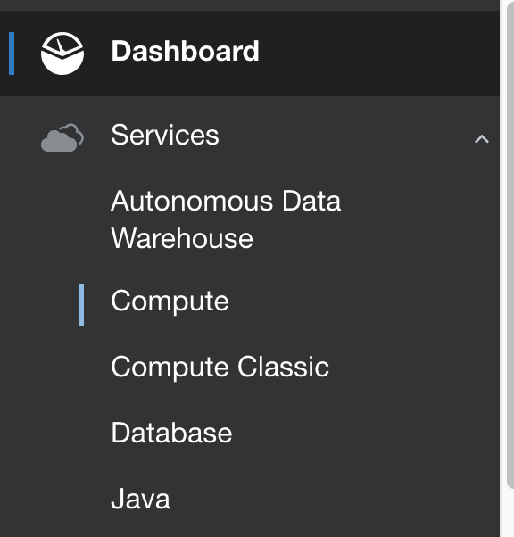
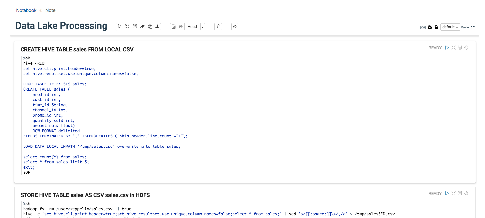

# **Lab 200 - Integrate big data into ADWC**

This second lab of the workshop will walk you through the steps to load big data stored in Oracle Data Lake which is a combination of Oracle Big Data Cloud (BDC) and Oracle Cloud Infrastructure (OCI) Object Storage to Oracle Autonomous Data Warehouse Cloud (ADWC) as shown in below figure.


The dataset is stored in HDFS of the BDC cluster on top of which we will create a Hive table called _SALES_. It is then processed and pushed to OCI Object Storage as a csv file _sales.csv_. The target system Oracle ADWC will pull this file from the OCI Object Storage as a table _SALES_.

You can also store your big data file in OCI Object Storage, send it to BDC cluster HDFS, process and then push it back to OCI Object Storage which is not covered in this lab.


## Objectives
The objectives of this lab are:

* Provision an Oracle Big Data Cloud (BDC) instance
* Upload data into HDFS of the BDC cluster node
* Create an Object Storage bucket in Oracle Cloud Infrastructure (OCI)
* Process and store the data from BDC HDFS to OCI Object Storage bucket
* Create an empty table in ADWC
* Load processed big data file from OCI Object Storage to Oracle ADWC
* Verify if the data is loaded in ADWC

## Prerequisites
* Please ensure you are connected to your cloud account and have provisioned an ADWC instance. Refer to [Introduction-Start-Here.md](Introduction-Start-Here.md) on how to provision an ADWC.

## A little about the services
### Oracle Big Data Cloud
* The power of Hadoop and Spark delivered as a secure, automated, high-performance service, which can be fully integrated with existing enterprise data in Oracle Database and Oracle Applications.
* **Dedicated**: Dedicated instances, networks and direct attached disk deliver consistent high-performance.
* **Secure**: Fully secured and encrypted Hadoop clusters, with additional ability to extend Oracle Database security to Hadoop.
* **Optimized**: Optimized configuration based on the specific compute shapes, enables fast time to value.
* **Comprehensive**: Includes the fully supported Cloudera Hadoop (including Apache Spark) ecosystem. Additional included Oracle software: Data Integration, R Distribution, Spatial and Graph.

#### Big Data Cloud Console
* Access Big Data Cloud Console from the instance overview page.
* It provides a dashboard that shows the HDFS storage availability and usage, CPU and memory usage, running jobs etc.
  

* Big Data Cloud comes out-of-the-box with Zeppelin notebooks.
* Notebooks provide a way to  write code within the same page with the use of different interpreter bindings such as %spark, %pyspark, %sql, %sh, %r, %jdbc, %hbase etc. to run the Big Data workloads.
  


### Oracle Cloud Infrastructure (OCI) Object Storage
* Oracle Object Storage is a web-based interface that provides the ability to accelerate a broad range of high performance applications with your choice of high IO block storage, and durable, high-throughput object storage.
* **Highly durable and available**: Automatically replicates objects across multiple fault domains for high durability. Actively monitored for data integrity and availability.
* **Unlimited Scale**: Store unlimited objects per bucket for large amounts of unstructured data like videos, backups, and logs.
* **High Throughput**: Low latency, strongly consistent regional service has the throughput to support high speed streaming and Big Data workloads.


# Steps

## **Source: Oracle Big Data Cloud (BDC) + OCI Object Storage**
### Step 1: Provisioning BDC
- Please follow **Lab 100: Provisioning of Services** of [this](https://oracle.github.io/learning-library/workshops/datalake-journey-on-oci/) lab to provision a new BDC instance on OCI.

### Step 2: Upload file **sales.csv** to BDC
- Download compressed **sales.csv** from [this](https://github.com/cloudsolutionhubs/Autonomous-Data-Management/blob/master/data/sales.csv.zip) link and unzip.
- Open a terminal and copy this file to BDC instance using `scp`.
    `$ scp -i <privateKey> <path to sales.csv> opc@<BDC IP Address>:/tmp`

### Step 3: Create an Object Storage bucket in OCI
- Sign in to your Oracle Cloud account and from Dashboard, click **Compute**.


- Click on the hamburger menu on the top left and select **Object Storage** > **Object Storage**.


- Select a compartment from the dropdown on the left, and click on **Create Bucket**.


- Enter a name for your bucket and keep the **STORAGE TIER** as **STANDARD**. Click on **Create Bucket**.


### Step 4: Process data in BDC and push to OCI Object Storage
- Download the Notebook from [this](https://github.com/cloudsolutionhubs/Autonomous-Data-Management/blob/master/Lab200-DataLakeProcessing.json) link as a json file.
- From the Big Data Cloud console, click on the hamburger menu of the instance you created and click **Big Data Cloud Console**.


- Click on the **Notebook** tab to import the downloaded zeppelin notebook.


- Click **Import Note** and then **Browse** to import the notebook file downloaded previously.


- Review the content of the notebook, and run each paragraph of the notebook one after the other by clicking the triangle button on top right to create hive table and load data in HDFS to an OCI Object Storage bucket.

  **Note**: Remember to replace your bucket name and your cloud account identity domain in the last paragraph of the notebook.


### Step 5: Verify file in OCI Object Storage
- Once you have successfully finished running all sections of the notebook, you should be able to see _sales.csv_ in your OCI bucket.


### Step 6: Generate an AuthToken
* AuthToken is required for an ADWC instance to access data files on Object Storage.

* From the OCI Console, click **Identity** > **User**.


* After selecting a user, click **Auth Tokens** and then **Generate Token**. Fill in the description and click **Generate Token**. A random token will be generated. Make sure to copy and save the value that is generated.


## **Target: Oracle ADWC - *CUSTOMERS* table**
### Step 1: Create empty table **SALES**.
- Go to your ADWC_USER SQL Developer connection.
- Create an empty table called **SALES** in ADWC which is the target.
    ```
    begin
    execute immediate 'DROP TABLE sales';
    exception when others then null;
    end;
    /

    CREATE TABLE sales (
    prod_id             NUMBER          NOT NULL,
    cust_id             NUMBER          NOT NULL,
    time_id             DATE            NOT NULL,
    channel_id          NUMBER(6)       NOT NULL,
    promo_id            NUMBER          NOT NULL,
    quantity_sold       NUMBER(10,2)    NOT NULL,
    amount_sold         FLOAT    NOT NULL);
    ```

### Step 2: Create Credential Store
- In `create_credential` function, please make sure you copy the `username` as the username of the user you created or generated AuthToken for and the `password` as the AuthToken you stored before for this user.
  ```
  --- Create a Object Storage Credential Store
  BEGIN
    dbms_cloud.drop_credential(credential_name => 'OBJ_STORE_CRED');
    exception when others then null;
  END;
  /

  set define off
  begin
    DBMS_CLOUD.create_credential(
      credential_name => 'OBJ_STORE_CRED',
      username => 'api.user',
      password => 'ONnKn-1f_x{x1RmVRAR3'
    );
  end;
  /
  set define on
  ```
### Step 3: Run Scripts to load
- Construct the URL of the files in your OCI Object Storage bucket like this:
`https://swiftobjectstorage.<region_name>.oraclecloud.com/v1/<tenant_name>/<bucket_name>/<file_name>`.
- Run the below script after replacing `base_url` with the url you have just constructed and pasting it in the ADWC SQL Developer connection.
  ```
  define base_URL='https://swiftobjectstorage.us-ashburn-1.oraclecloud.com/v1/<identitydomain>/<BucketName>'

  define sales_URL = '&base_URL/sales.csv';

  begin
  dbms_cloud.copy_data(
      table_name =>'SALES',
      credential_name =>'OBJ_STORE_CRED',
      file_uri_list => '&sales_URL',
      format => json_object('ignoremissingcolumns' value 'true', 'skipheaders' value '1', 'delimiter' value ',', 'removequotes' value 'true', 'blankasnull' value 'true')
  );
  end;
  /
  ```
### Step 4: Verify **SALES** table is populated
- Now that you have run scripts to load data from OCI Object Storage bucket to your Oracle BDC, verify if you can see the table _SALES_ in your ADWC_USER connection in SQL Developer.


- You have successfully finished loading big data from OCI Object Storage and Oracle Big Data Cloud to Oracle Autonomous Data Warehouse.


