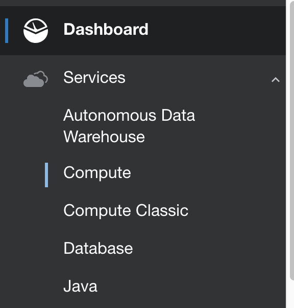
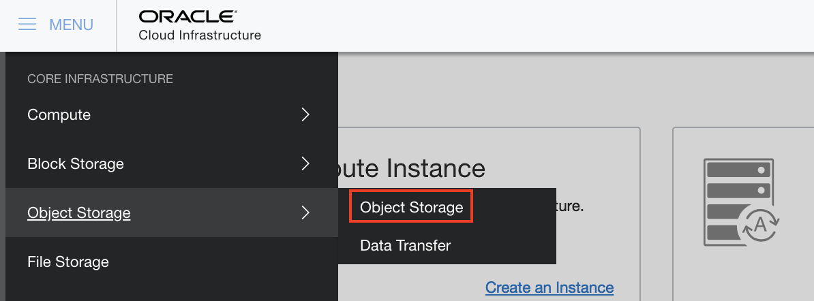
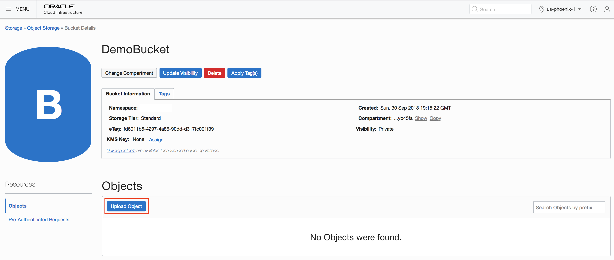
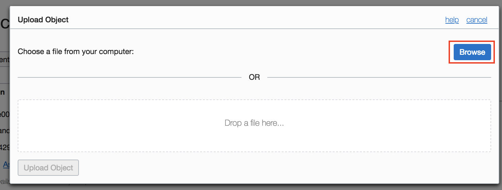
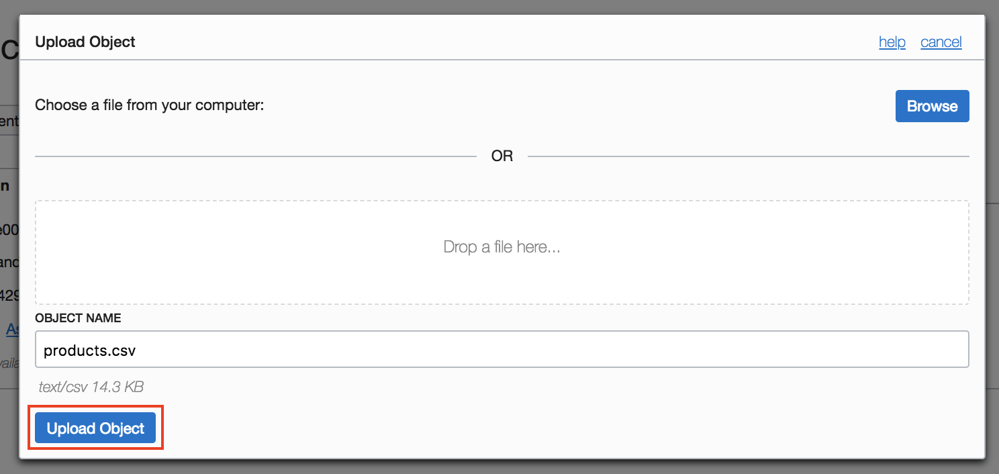
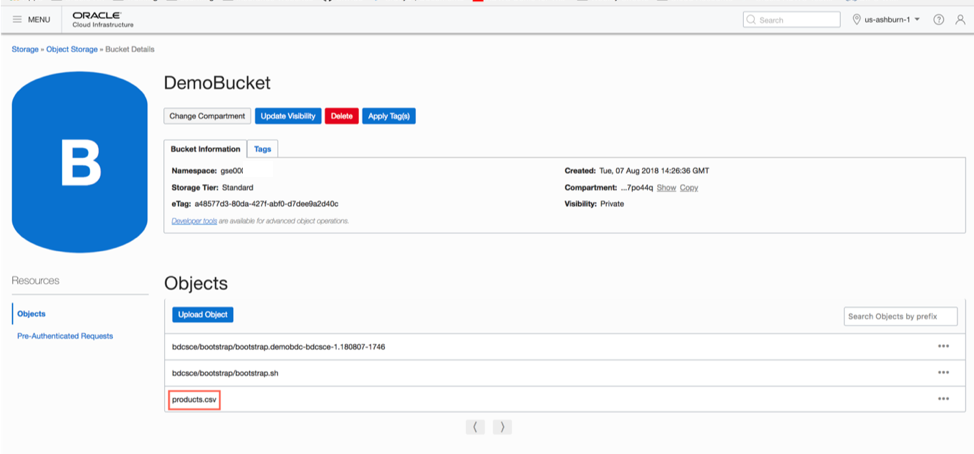
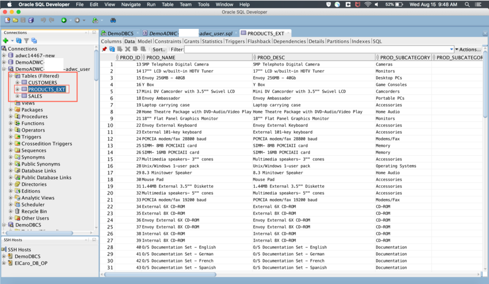

# **Lab 300 - Create External Table in ADWC**

This third lab of the workshop demonstrates how one can create an external table in Oracle Autonomous Data Warehouse Cloud (ADWC) from the data stored in Oracle Cloud Infrastructure (OCI) Object Storage (as shown below). By creating an external table, you can query files on the OCI Object Storage directly without loading them to your database such as ADWC in this case.


The data is stored in an OCI Object Storage bucket as a csv file called _products.csv_. We use `create_external_table()` function of the `DBMS_CLOUD` package to create an external table _PRODUCTS_EXT_ in Oracle ADWC.


## Objectives:
The objectives of this lab are:

* Upload data file to the OCI Object Storage bucket created in [Lab200-IntegrateBigDataIntoADWC.md](Lab200-IntegrateBigDataIntoADWC.md)
* Run script to create an external table in ADWC
* Run a sample query to verify if the external table is created in ADWC


## Prerequisites
* Please ensure you are connected to your cloud account and have provisioned an ADWC instance. Refer to [Introduction-Start-Here.md](Introduction-Start-Here.md) on how to provision an ADWC.
* You can use the same bucket you created in [Lab200-IntegrateBigDataIntoADWC.md](Lab200-IntegrateBigDataIntoADWC.md) or you can create a new bucket in OCI Object Storage.


# Steps

## **Source: OCI Object Storage**

### Step 1: Upload _products.csv_ to OCI Object Storage
- Download **products.csv** from [this](https://github.com/cloudsolutionhubs/Autonomous-Data-Management/blob/master/data/products.csv) link.
- Sign in to your Oracle Cloud account and from Dashboard, click **Compute**.


- Click on the hamburger menu on the top left and select **Object Storage** > **Object Storage**.


- Select an appropriate compartment and create a new bucket or select an existing bucket.
- Click on **Upload Object**.


- Browse the _products.csv_ file downloaded to your local machine earlier.


- Once you select _products.csv_, click on **Upload Object**.


- The file should be now uploaded to your OCI Object Storage bucket.



## **Target: ADWC**

### **Step 1: Create External Table**
- Go to your _ADWC_USER_ SQL Developer connection and copy the below script. Remember to replace the `base_URL` with your specific values for `<identitydomain>` and `<BucketName>`.
    ```
    define base_URL='https://swiftobjectstorage.us-ashburn-1.oraclecloud.com/v1/<identitydomain>/<BucketName>'
    define products_URL = '&base_URL/products.csv';

    begin
    dbms_cloud.create_external_table(
    table_name =>'PRODUCTS_EXT',
    credential_name =>'OBJ_STORE_CRED',
    file_uri_list =>'&products_URL',
    format => json_object('ignoremissingcolumns' value 'true', 'removequotes' value 'true', 'delimiter' value ',', 'skipheaders' value '1'),
    column_list => 'prod_id NUMBER(6),
        prod_name VARCHAR2(50),
        prod_desc VARCHAR2(4000),
        prod_subcategory VARCHAR2(50),
        prod_subcategory_id NUMBER,
        prod_subcategory_desc VARCHAR2(2000),
        prod_category VARCHAR2(50),
        prod_category_id NUMBER,
        prod_category_desc VARCHAR2(2000),
        prod_weight_class NUMBER(3),
        prod_unit_of_measure VARCHAR2(20),
        prod_pack_size VARCHAR2(30),
        supplier_id NUMBER(6),
        prod_status VARCHAR2(20),
        prod_list_price NUMBER(8,2),
        prod_min_price NUMBER(8,2),
        prod_total VARCHAR2(13),
        prod_total_id NUMBER,
        prod_src_id NUMBER,
        prod_eff_from DATE,
        prod_eff_to DATE,
        prod_valid VARCHAR2(1)'
    );
    end;
    /
    ```

### **Step 2: Verify in ADWC**
- Check whether _PRODUCTS_EXT_ table is created in ADWC by refreshing the tables of _ADWC_USER_ as shown in the following figure.


- You have successfully created an external table in Oracle Autonomous Data Warehouse Cloud instance without loading the data from the OCI Object Storage where it still resides. Now, you can query this table _PRODUCTS_EXT_ similar to how you query any other table in ADWC.