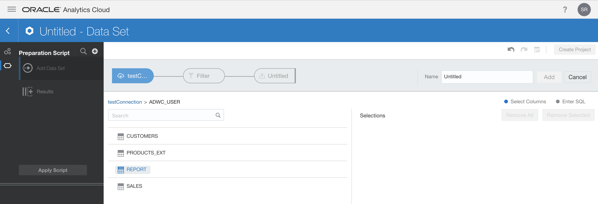

# Lab 400 - Visualization using Oracle Analytics Cloud (OAC)

Now that we have three tables - _CUSTOMERS_, _SALES_ and _PRODUCTS_EXT_ - in our Oracle Autonomous Data Warehouse Cloud (ADWC) database, we can create a consolidated report on all of these three tables and visualize the results using Oracle Analytics Cloud (OAC).


## Objectives
* Create a sample consolidated view on all the tables in ADWC
* Use OAC to visualize and analyze the report

## Prerequisites
- Please ensure you are connected to your cloud account and have provisioned an ADWC instance. Refer to [Introduction-Start-Here.md](Introduction-Start-Here.md) on how to provision an ADWC.
- You should have completed labs [Introduction-Start-Here.md](Introduction-Start-Here.md), [Lab100-IntegrateRelationalDataIntoADWC.md](Lab100-IntegrateRelationalDataIntoADWC.md), [Lab200-IntegrateBigDataIntoADWC.md](Lab200-IntegrateBigDataIntoADWC.md), and [Lab300-CreateExternalTableInADWC.md](Lab300-CreateExternalTableInADWC.md).

## A little about the services
### Oracle Analytics Cloud (OAC)
* Oracle Analytics powers every decision to be data-driven by connecting people, places, data, and systems to fundamentally change how you analyze, understand, and act on information.
* **Connected**: Bringing the power of analytics to any data, enabling every process, decision, and action to be data-driven
* **Collaborative**: Amplifying human insights to conquer the barriers of complex interactions and information overload
* **Complete**: Empowering everyone with comprehensive capabilities, from self-service data discovery to powerful predictive analytics, enterprise-class reporting, and easy what-if analysis

# Steps

## Create a sample consolidated view on all the tables in ADWC
- Now that you have all the three tables _CUSTOMERS_, _SALES_ and _PRODUCTS_EXT_ in Oracle ADWC, you can run queries and analysis and create reports on the consolidated data.
- Open _ADWC_USER_ SQL Developer connection and create a sample view by copying the below code.
- This view selects data from all the three tables to show how much each customer spent on each product category.
```
CREATE or replace view REPORT AS 
    SELECT S.CUST_ID, C.CUST_FIRST_NAME, C.CUST_LAST_NAME, P.PROD_CATEGORY, SUM(S.AMOUNT_SOLD) TOTAL_AMOUNT
    FROM SALES S, CUSTOMERS C, PRODUCTS_EXT P
    WHERE S.CUST_ID=C.CUST_ID AND S.PROD_ID=P.PROD_ID
    GROUP BY S.CUST_ID, C.CUST_FIRST_NAME, C.CUST_LAST_NAME, P.PROD_CATEGORY
    ORDER BY S.CUST_ID, TOTAL_AMOUNT;
```

## Provision OAC
- You need a database instance as a prerequisite to create an OAC instance. You can use one of those created in the previous labs or you can create a new database instance.
- Go to Oracle Cloud Console dashboard and select **Analytics**.
    

- Click on **Create Instance** on the Oracle Analytics Cloud console.
    

- Provide details for your instance. In the **Instance** page, provide the following information:
    - **Service Name**: Give a name you would like to use to identify your OAC service
    - **Region**: Provide **No Preference**
    - **SSH Public Key**: Provide an existing public key or create a new public/private keypair
    - **Software Edition**: Select **Oracle Analytics Cloud - Enterprise Edition** from the dropdown
    - Click **Next**
    

- In the **Details** section,
    - In **Options** subsection, check the box for **Data Visualization - Self-Service Data Visualization, Preparation and Smart Delivery**, select the least size of RAM and OCPU in **Size** field.
    - **Cloud Storage Configuration**
        - **Analytics Storage Container URL**: It is usually prepopulated, review the link
        - **Analytics Storage User**: Provide your cloud account's username
        - **Analytics Storage Password**: Provide your cloud account's password
        - Check the box for **Create Analytics Storage Container** field.
    - **Service Administrator**
        - **Username**: Usually, it is **admin**
        - **Password**: Provide any password you can easily remember
        - Confirm the password again
    - **Database**
        - **Database Service Name**: Select the database you want to associate with this OAC instance
        - **PDB**: Provide the pdb name of this database's pdb. This is usually **pdb1**, but this is what you might have given during the provisioning of the database instance
        - **Database Administrator Username**: This is usually **sys** provided during the provisioning of the database instance
        - **Database Administrator Password**: Provide the provisioning password for the database instance
    - Click **Next**
    

- In the **Confirm** section, review all the details and then click on **Create**.
    

- Once it is provisioned, you will see the **Status** as **Ready** on the Oracle Analytics Cloud console.
    

## Visualization
- Once your Oracle Analytics Cloud instance is ready, click on the instance's hamburger menu on the OAC console and select **Oracle Analytics Cloud URL**.
    

- Log in using the **Username** and **Password** you have provided when provisioning the OAC instance in the **Service Administrator** section.
    

- Click on **Create** on the top right and select **Connection**. You are making connection to your Oracle ADWC instance from the Oracle Analytics Cloud instance to create and view the visualizations.
    

- Select **Oracle Autonomous Data Warehouse Cloud** in the **Connection Type**. Please feel free to review the other kinds of connection types.
   

- Provide connection details for the Autonomous Data Warehouse Cloud instance which can be found in the _tnsnames.ora_ file of the Client Credential wallet zip file downloaded from the ADWC console. In the **Client Credentials** section, upload the _cwallet.sso_ file of the unzipped ADWC wallet zip file. After filling all the required information, click on **Save**.
    

- Once it says connection is successfully saved, click on **Create** and then on **Data Set**.
    

- Select the connection that you just created.
    

- Wait for the connection to load and select the _ADWC_USER_ schema that you created in your ADWC instance.
    

- You will see all the tables and views in this user's schema. Select **REPORT** as this is the view we created in the previous steps that has the data from all the three tables.
    

- Now, you will see all the columns in this view, click on **Add All**.
    

- Give a name for your dataset and click on **Add**.
    

- You will see a status bar that says **Profiling Data**. After that disappears, click on **Create Project**.
    

- Make sure you are in the **Visualize** mode (check on the top left).
    - Drag and drop **TOTAL_AMOUNT** from the **Data Elements** side bar on to the canvas. Now, you will see different options to select Y-Axis, X-Axis, type of chart, filters and many more.
    - Change the type of chart (the top most field) to **Stacked Bar**.
    - Check if **TOTAL_AMOUNT** is under **Values (Y-Axis)**.
    - Drag and drop **CUST_FIRST_NAME** into the **Category (X-Axis)** field.
    - Drag and drop **PROD_CATEGORY** into **Color** field.
    - Select **CUST_ID** in the left side bar and in the bottom section, click on the two small gears. Change **Measure** to **Attribute** in the **Treat As** field.
    
        

        
    - Wait for it to change and then drag **CUST_ID** to **Filters** field. Select the customer ids you want to view. Click anywhere on the canvas to exit the filter selection dialog box.
- Now, you will see the total visualization and click on **Save** to save this project and give a name to your project.
    

- You can share this visualization across th entire organization by clicking on share button on the top right and choosing the required format.
    

- You have just finished creating a visualization on Oracle Analytics Cloud using the data in Oracle Autonomous Data Warehouse Cloud instance.
- This is the end of this workshop. In summary, in this workshop, you have achieved loading the data from different sources into the Oracle Autonomous Data Warehouse Cloud Service and create visualizations on top of this consolidated data.